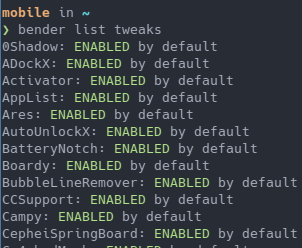
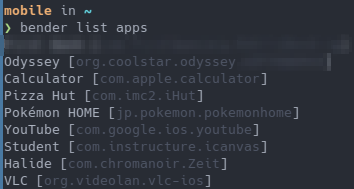
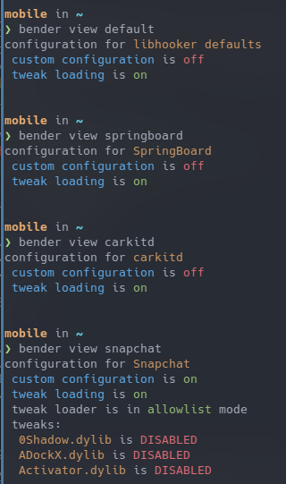
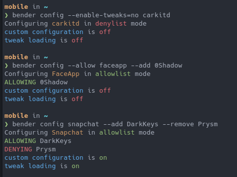

# bender

bender is a CLI configuration utility written in Rust, for coolstar's libhooker iOS tweak loader,
providing a terminal-based alternative to the [SwiftUI-based libhooker-configurator](https://github.com/coolstar/libhooker-configurator) - which,
while convienent, is sometimes buggy or non-functional on older iOS versions.

Also, I have heavily documented the source code for this, in the hopes to make it easier to understand for people who don't know Rust.

## How to use

bender has a simple command interface, which can be referred to with `bender --help` at any time.

### Listing tweaks or apps

 > `bender list tweaks`

 > `bender list apps`

 > `bender list daemons`

### Viewing configuration

 > `bender view [target]`

### Setting configuration

 > `bender config [--allow | --deny] [--enable-tweaks=yes/no/true/false] [--custom-config=yes/no/true/false] <target> [--add Tweak1 Tweak2.dylib ...] [--remove Tweak3.dylib Tweak4 ...]`

## Building

Requirements:

 - the Rust toolchain (it's preferred to use [rustup](https://rustup.rs/) over a package manager's distribution)
   - Ensure you have the `aarch64-apple-ios` target installed. If not, run `rustup target add aarch64-apple-ios`.
   - If building on Linux, you need to have a path to an [iOS SDK](https://github.com/xybp888/iOS-SDKs) in the environmental variable `SDKROOT`. In addition, you should put an executable shell script named `xcrun` within your path that simply echos the path to your iOS SDK.
 - Clang
 - [cctools-port](https://github.com/tpoechtrager/cctools-port)
 - [ldid2](https://github.com/xerub/ldid)

If on Linux, it is reccomended to just run [the Procursus toolchain setup script](https://gist.github.com/1Conan/4347fd5f604cfe6116f7acb0237ef155), it will compile cctools-port, ldid, and download the iOS SDK automatically.

Once all this is setup, you can simply compile a runnable binary with two commands, from the repository root:

> `cargo build --release --target aarch64-apple-ios`
>
> `ldid2 -Sgeneral.xml target/aarch64-apple-ios/release/bender`

Your binary is now available at the path `target/aarch64-apple-ios/release/bender`!

## License

> Copyright (c) 2021, aspen
>
> All rights reserved.
>
>
> Redistribution and use in source and binary forms, with or without
> modification, are permitted provided that the following conditions are met:
> 1. Redistributions of source code must retain the above copyright notice, this list of conditions and the following disclaimer.
> 2. Redistributions in binary form must reproduce the above copyright notice, this list of conditions and the following disclaimer in the documentation and/or other materials provided with the distribution.
> 3. All advertising materials mentioning features or use of this software must display acknowledgement that this software was developed by aspen.
> 4. Neither the name of aspen nor the names of its contributors may be used to endorse or promote products derived from this software without specific prior written permission.
> 5. You may not redistribute this software, either in source or binary form, if you remove any license text or associated commentary contained adjacent to the license text.
> 6. This software may only be used where libhooker is permitted to be used; use or redistribution of this software is not allowed in any situation where the use or redistribution of libhooker is also not allowed.
>
> THIS SOFTWARE IS PROVIDED BY aspen ''AS IS'' AND ANY EXPRESS OR IMPLIED WARRANTIES, INCLUDING, BUT NOT LIMITED TO, THE IMPLIED WARRANTIES OF MERCHANTABILITY AND FITNESS FOR A PARTICULAR PURPOSE ARE DISCLAIMED. IN NO EVENT SHALL aspen BE LIABLE FOR ANY DIRECT, INDIRECT, INCIDENTAL, SPECIAL, EXEMPLARY, OR CONSEQUENTIAL DAMAGES (INCLUDING, BUT NOT LIMITED TO, PROCUREMENT OF SUBSTITUTE GOODS OR SERVICES; LOSS OF USE, DATA, OR PROFITS; OR BUSINESS INTERRUPTION) HOWEVER CAUSED AND ON ANY THEORY OF LIABILITY, WHETHER IN CONTRACT, STRICT LIABILITY, OR TORT (INCLUDING NEGLIGENCE OR OTHERWISE) ARISING IN ANY WAY OUT OF THE USE OF THIS
> SOFTWARE, EVEN IF ADVISED OF THE POSSIBILITY OF SUCH DAMAGE.
